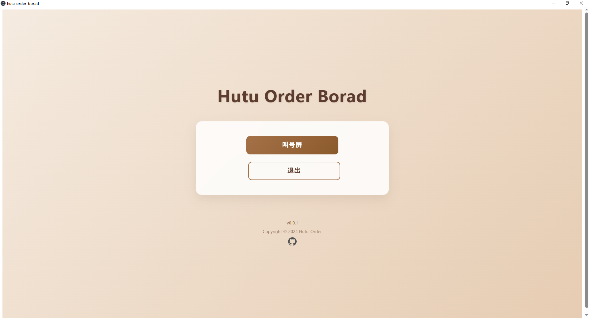

# hutu-order-board
糊涂点餐商家叫号屏

## 介绍

通过WebSocket实现商家端与服务端之间的通信，服务端下单后，服务端会推送给商家端，商家端会显示到大屏中，通过长连接感知订单制作完成、订单完成的功能。

## 运行

1. 运行HutuOrder - hutu-web-socket - HutuWebSocketApplication
2. npm install
3. npm run dev

## 依赖

0. node 22.12.0+
1. Electron@latest
2. Vite@latest
3. Vue@latest
4. Element Plus@latest

## 截图

